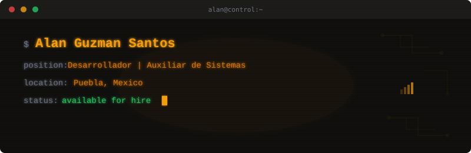

  

<h1 align="center">Hola 👋, Alan Guzman</h1>
<h3 align="center">Desarrollador / Auxiliar de Sistemas</h3>

<code>Construyendo sistemas confiables con arquitectura limpia y soluciones escalables.</code>

  <a href="#sobre-mí">Sobre mí</a> •
  <a href="#tech-stack">Tech Stack</a> •
  <a href="#experiencia">Experiencia</a> •
  <a href="#proyectos">Proyectos</a> •
  <a href="#estadísticas">Estadísticas</a> •
  <a href="#conéctame">Conéctame</a>

---

## 🚀 Sobre mí

Desarrollador y Auxiliar de Sistemas con experiencia en soporte técnico, desarrollo de software y administración de infraestructura. Enfocado en arquitectura de software y proyectos empresariales.

Actualmente trabajo en **Alcomex Transporte y Logística** como Auxiliar de Sistemas y Desarrollador. Anteriormente trabajé en **Agua Inmaculada**, **IT Solutions Global**, **Tejido Punto Textil** y **Corporativo MMI**.

Mi objetivo es simple: escribir código limpio, construir software confiable y crecer como ingeniero de software que crea sistemas que perduran.

---

## 💻 Tech Stack

  

  

  

---

## 💼 Experiencia

| Empresa | Cargo | Periodo |
|---|---|---|
| **Alcomex Transporte y Logística** | Auxiliar de Sistemas / Desarrollador | Sep 2025 - Presente |
| **Agua Inmaculada** | Auxiliar de Sistemas / Desarrollador | Nov 2015 - Sep 2025 |
| **IT Solutions Global Incorporated** | — | Sep 2024 - Jun 2025 |
| **Tejido Punto Textil S.A. de C.V.** | — | Feb 2024 - Jun 2024 |
| **Corporativo MMI** | — | Feb 2021 - Ago 2023 |

---

## 📂 Proyectos

| Proyecto | Descripción |
|---|---|
| [HELPDESK](https://github.com/powerslave12334/HELPDESK) | Sistema de gestión de tickets de soporte técnico con ASP.NET Core 8.0 y SQL Server |

---

## 📊 Estadísticas

  
  

  

---

## 🔗 Conéctame

  
  
  
  

